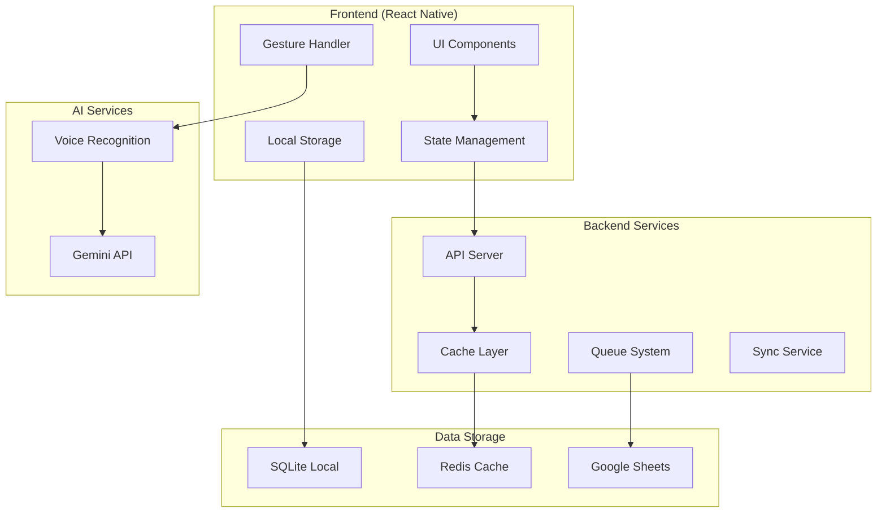

# 📱 Virtual Data 포커 데이터 매니저 - 5인치 스마트폰 전용 설계 기획서

## 📋 목차
1. [프로젝트 개요](#프로젝트-개요)
2. [핵심 혁신 기능](#핵심-혁신-기능)
3. [UI/UX 상세 설계](#uiux-상세-설계)
4. [기술 아키텍처](#기술-아키텍처)
5. [데이터 플로우 설계](#데이터-플로우-설계)
6. [핵심 기능 상세 명세](#핵심-기능-상세-명세)
7. [성능 최적화 전략](#성능-최적화-전략)
8. [개발 로드맵](#개발-로드맵)
9. [테스트 전략](#테스트-전략)
10. [배포 및 운영 계획](#배포-및-운영-계획)

---

## 🎯 프로젝트 개요

### 비전
**"5인치 스마트폰 한 손으로 완벽하게 조작 가능한 포커 데이터 입력 시스템"**

### 핵심 가치
- **한 손 조작**: 엄지 하나로 모든 기능 접근
- **초고속 입력**: 핸드당 90초 이내 완료
- **무스크롤**: Bottom Sheet로 모든 작업 완료
- **이동성**: 걸어다니며 데이터 입력 가능

### 목표 사용자
- **주 사용자**: 포커 토너먼트 데이터 매니저
- **경험 수준**: 포커 규칙은 알지만 기술적 전문성은 낮음
- **사용 환경**: 카지노 현장, 소음이 있는 환경, **한 손으로 이동하며 사용**

### 제약 사항
- **네트워크**: 불안정한 WiFi 환경
- **디바이스**: **5인치 스마트폰 (세로 모드 전용)**
- **사용 시간**: 8-12시간 연속 사용
- **조작**: **한 손 조작 필수** (다른 손은 메모/카메라)
- **환경**: 조명 변화, 소음, 이동성 필요

---

## 🚀 핵심 혁신 기능

### 1. T-9 스타일 스와이프 칩 입력 시스템

#### 개념
전화기 T-9 입력 방식과 스와이프 제스처를 결합한 혁신적 칩 입력 시스템

#### 핵심 특징
```
╔═══╦═══╦═══╦═══╗
║ 1 ║ 2 ║ 3 ║ × ║  삭제
╠═══╬═══╬═══╬═══╣
║ 4 ║ 5 ║ 6 ║ K ║  ×1,000
╠═══╬═══╬═══╬═══╣
║ 7 ║ 8 ║ 9 ║ M ║  ×1,000,000
╠═══╬═══╬═══╬═══╣
║ . ║ 0 ║00 ║ ✓ ║  확인
╚═══╩═══╩═══╩═══╝
```

#### 제스처 패턴
- **위로 스와이프**: ×10
- **오른쪽 스와이프**: ×100
- **대각선 스와이프**: ×1,000
- **원형 스와이프**: ALL-IN
- **더블탭 00**: 백단위 빠른 입력

### 2. 멀티모달 입력 시스템

#### 음성 입력
- 한국어/영어 동시 지원
- 카지노 노이즈 필터링
- 실시간 음성-텍스트 변환

#### 터치 입력
- 드래그 앤 드롭 카드 선택
- 핀치 줌 테이블 뷰
- 롱프레스 상세 정보

#### 햅틱 피드백
- 성공: 부드러운 진동
- 에러: 더블 진동
- ALL-IN: 강한 진동

### 3. 3-Layer 캐싱 아키텍처

```
L1: 로컬 메모리 (1ms)
 ↓
L2: Redis 캐시 (10ms)
 ↓
L3: Google Sheets (500ms)
```

---

## 🎨 UI/UX 상세 설계

### 화면 구조

#### 1. 홈 대시보드
```
┌─────────────────────────────────────────┐
│ VIRTUAL DATA POKER                  ⚙️  │
├─────────────────────────────────────────┤
│                                         │
│  ┌───────────────┐ ┌───────────────┐   │
│  │ 키 플레이어    │ │ 최근 핸드     │   │
│  │     관리      │ │     목록      │   │
│  │      👑       │ │      📋       │   │
│  └───────────────┘ └───────────────┘   │
│                                         │
│  ┌───────────────┐ ┌───────────────┐   │
│  │  테이블 뷰    │ │   통계 현황    │   │
│  │      🎰       │ │      📊       │   │
│  └───────────────┘ └───────────────┘   │
│                                         │
│  ┌─────────────────────────────────┐   │
│  │     빠른 칩 업데이트     🚀      │   │
│  └─────────────────────────────────┘   │
│                                         │
└─────────────────────────────────────────┘
```

#### 2. 통계 현황 상세 화면

```
┌─────────────────────────────────────────┐
│ ← STATISTICS DASHBOARD           🔄 새로고침 │
├─────────────────────────────────────────┤
│                                         │
│ 📊 오늘의 작업 현황                     │
│ ┌─────────────────────────────────┐    │
│ │ 입력한 핸드: 47개                │    │
│ │ 칩 업데이트: 128회               │    │
│ │ 작업 시간: 3시간 25분            │    │
│ │ 평균 입력 속도: 2.3분/핸드        │    │
│ └─────────────────────────────────┘    │
│                                         │
│ 👑 키 플레이어 칩 리더보드              │
│ ┌─────────────────────────────────┐    │
│ │ 1. Phil Ivey      $485,000  ▲45K│    │
│ │ 2. D. Negreanu    $420,000  ▲20K│    │
│ │ 3. P. Hellmuth    $380,000  ▼15K│    │
│ │ 4. Tom Dwan       $350,000  ▲85K│    │
│ │ 5. D. Brunson     $320,000  ▼30K│    │
│ └─────────────────────────────────┘    │
│                                         │
│ 🔄 동기화 상태                          │
│ ┌─────────────────────────────────┐    │
│ │ Google Sheets: ✅ 동기화됨       │    │
│ │ 마지막 동기화: 2분 전            │    │
│ │ 대기 중인 업데이트: 3개          │    │
│ │ 오프라인 데이터: 0개             │    │
│ └─────────────────────────────────┘    │
│                                         │
│ 📈 시간대별 활동                        │
│ ┌─────────────────────────────────┐    │
│ │ 09:00 ████████ 12 핸드          │    │
│ │ 10:00 ██████████████ 18 핸드    │    │
│ │ 11:00 ████████████ 15 핸드       │    │
│ │ 12:00 ██ 2 핸드 (브레이크)        │    │
│ └─────────────────────────────────┘    │
│                                         │
│ ⚡ 주요 이벤트                          │
│ ┌─────────────────────────────────┐    │
│ │ • 11:45 Phil Ivey 올인 ($385K)  │    │
│ │ • 11:20 큰 팟 형성 ($500K+)      │    │
│ │ • 10:55 Tom Dwan 더블업          │    │
│ └─────────────────────────────────┘    │
│                                         │
└─────────────────────────────────────────┘
```

통계 현황 데이터 구성:

**1. 오늘의 작업 현황**
- 입력한 핸드 수: 데이터 매니저의 생산성 지표
- 칩 업데이트 횟수: 작업 빈도 측정
- 총 작업 시간: 실제 활동 시간
- 평균 입력 속도: 효율성 측정 (목표: 2분/핸드)

**2. 키 플레이어 칩 리더보드**
- 상위 5명 키 플레이어의 현재 칩 순위
- 실시간 칩 변동 표시 (증감량)
- 빠른 상황 파악을 위한 시각화

**3. 동기화 상태**
- Google Sheets 연결 상태
- 마지막 성공적 동기화 시간
- 대기 중인 업데이트 수
- 오프라인 저장 데이터 수

**4. 시간대별 활동 그래프**
- 시간별 핸드 입력 분포
- 피크 시간대 파악
- 브레이크 시간 확인

**5. 주요 이벤트 로그**
- 올인, 큰 팟 등 중요 이벤트
- 시간순 정렬
- 빠른 리뷰를 위한 요약

#### 3. 키 플레이어 관리 화면
```
┌─────────────────────────────────────────┐
│ ← KEY PLAYERS                     + ADD │
├─────────────────────────────────────────┤
│                                         │
│ 🔍 Search...                            │
│                                         │
│ ┌───────────────────────────────────┐  │
│ │ Phil Ivey          Table 25 #3    │  │
│ │ $340,000           ▲ +45K         │  │
│ │ [추적시작] [칩업데이트] [상세]      │  │
│ └───────────────────────────────────┘  │
│                                         │
│ ┌───────────────────────────────────┐  │
│ │ D. Negreanu        Table 25 #7    │  │
│ │ $290,000           ▼ -20K         │  │
│ │ [추적시작] [칩업데이트] [상세]      │  │
│ └───────────────────────────────────┘  │
│                                         │
└─────────────────────────────────────────┘
```

#### 3. 스와이프 칩 입력 화면
```
┌─────────────────────────────────────────┐
│ ← CHIP UPDATE - Phil Ivey              │
├─────────────────────────────────────────┤
│                                         │
│  현재: $340,000                        │
│  입력: $385,000                        │
│  변동: +$45,000 ▲                      │
│                                         │
│  ╔═══╦═══╦═══╦═══╗                    │
│  ║ 1 ║ 2 ║ 3 ║ × ║                    │
│  ╠═══╬═══╬═══╬═══╣                    │
│  ║ 4 ║ 5 ║ 6 ║ K ║                    │
│  ╠═══╬═══╬═══╬═══╣                    │
│  ║ 7 ║ 8 ║ 9 ║ M ║                    │
│  ╠═══╬═══╬═══╬═══╣                    │
│  ║ . ║ 0 ║00 ║ ✓ ║                    │
│  ╚═══╩═══╩═══╩═══╝                    │
│                                         │
│  빠른 선택:                            │
│  [25K] [50K] [100K] [250K] [ALL-IN]   │
│                                         │
│  [💾 저장] [↩️ 실행취소] [❌ 취소]      │
└─────────────────────────────────────────┘
```

#### 4. 핸드 입력 화면 (개선된 UI)

**핵심 개선사항: Thumb-Zone 최적화 & 플로팅 액션 바**

```
┌─────────────────────────────────────────┐
│ ← Table 25          Hand #177    ⚙️    │
├─────────────────────────────────────────┤
│                                         │
│ BOARD: [A♠][K♥][Q♦][ ][ ]     POT: $60K│
│                                         │
│ ┌───────────────────────────────────┐  │
│ │     Phil Ivey      D. Negreanu    │  │
│ │    ┌─────────┐   ┌─────────┐     │  │
│ │    │ $340K   │   │ $270K   │     │  │
│ │    │ [♠][♠]  │   │ [♥][♥]  │     │  │
│ │    └─────────┘   └─────────┘     │  │
│ │                                   │  │
│ │     John Smith    Empty Seat      │  │
│ │    ┌─────────┐   ┌─────────┐     │  │
│ │    │ $125K   │   │    -     │     │  │
│ │    │ [FOLD]  │   │          │     │  │
│ │    └─────────┘   └─────────┘     │  │
│ └───────────────────────────────────┘  │
│                                         │
│ STREET: [PRE][FLOP][TURN][RIVER]       │
│          ◉    ○     ○     ○            │
│                                         │
│ ┌───────────────────────────────────┐  │
│ │ 📜 Action Log (3)           ▼ 숨김 │  │
│ ├───────────────────────────────────┤  │
│ │ • PRE: Ivey RAISE $30K            │  │
│ │ • PRE: Negreanu CALL $30K         │  │
│ │ • PRE: Smith FOLD                 │  │
│ └───────────────────────────────────┘  │
│                                         │
│═════════════════════════════════════════│
│                                         │
│      💰 QUICK AMOUNTS 💰                │
│  [10K] [25K] [50K] [100K] [POT] [AI]  │
│                                         │
│      🎯 ACTION BUTTONS 🎯               │
│ ┌─────┬─────┬─────┬─────┬─────┐       │
│ │CHECK│ CALL│ BET │RAISE│ FOLD│       │
│ │  ✓  │  📞 │  💰 │  📈 │  🚫 │       │
│ └─────┴─────┴─────┴─────┴─────┘       │
│                                         │
│ [🎤 음성] [📸 사진] [💾 저장] [↩️ 취소] │
└─────────────────────────────────────────┘
```


### 📱 스마트폰 미니멀 UI 설계

#### 핵심 컨셉: "One Screen, Many Layers"
단일 화면에서 레이어(Bottom Sheet)로 모든 작업 완료 - 스크롤/페이지 이동 최소화

#### 1. 메인 화면 (Ultra Minimal)

```
┌─────────────────────────┐
│ 09:45            🔋 85% │  5.5" 스마트폰
├─────────────────────────┤
│                         │
│  $485K    Phil Ivey     │  ← 탭하면 플레이어 전환
│   ▲45K    Table 25      │     스와이프로 다음 플레이어
│                         │
│  $420K    Negreanu      │
│   ▲20K    Table 25      │
│                         │
│  $380K    Hellmuth      │
│   ▼15K    Table 8       │
│                         │
│  ───────────────────    │
│                         │
│  47 핸드  128 칩업데이트 │  ← 오늘 통계
│  3:25     2.3분/핸드    │
│                         │
│ ╔═══════════════════╗   │
│ ║   🎯 핸드 입력    ║   │  ← 메인 액션 버튼
│ ╚═══════════════════╝   │
│                         │
│ [📊] [👑] [⚡] [🔄]     │  ← 하단 네비게이션
└─────────────────────────┘
```

#### 2. Bottom Sheet 시스템

**Level 1: Quick Actions (25% 화면)**
```
╔══════════════════════════╗
║ Phil Ivey - Quick Update ║
╟──────────────────────────╢
║ [+10K][+25K][+50K][+100K]║
║ [칩입력] [핸드시작] [탈락]║
╚══════════════════════════╝
```

**Level 2: Chip Input (50% 화면)**
```
╔══════════════════════════╗
║        $385,000          ║
╟──────────────────────────╢
║  [1][2][3]  ×            ║
║  [4][5][6]  K            ║
║  [7][8][9]  M            ║
║  [.][0][00] ✓            ║
╚══════════════════════════╝
```

**Level 3: Hand Input (75% 화면)**
```
╔══════════════════════════╗
║ [A♠][K♥][Q♦][ ][ ]  $60K ║
╟──────────────────────────╢
║ Ivey     Negreanu        ║
║ $340K    $270K           ║
║ [♠][♠]   [♥][♥]          ║
╟──────────────────────────╢
║ [CHECK][CALL][BET]       ║
║ [RAISE][FOLD][ALL-IN]    ║
╟──────────────────────────╢
║ [25K][50K][POT][×2]      ║
╚══════════════════════════╝
```

#### 3. 카드 스택 네비게이션

```
플레이어 카드 스택:
┌──────┐
│ Ivey │ ← 현재 카드
├──────┤
│Negrea│ ← 다음 (아래 살짝 보임)
├──────┤
│Hellmu│
└──────┘

↑ 스와이프: 다음 플레이어
↓ 스와이프: 이전 플레이어
← 스와이프: 테이블 변경
→ 스와이프: 액션 메뉴
```

#### 4. 플로팅 입력 시스템

**컨텍스트 인식 입력창:**
```
기본 상태 (하단 고정):
─────────────────
[🎯]  미니 플로팅 버튼

탭하면 확장:
╔════════════════╗
║ CHECK CALL BET ║
║ RAISE FOLD AI  ║
╚════════════════╝

금액 입력 필요시:
╔════════════════╗
║    $50,000     ║
║ [25K][POT][AI] ║
║ 1 2 3 4 5 6 7  ║
╚════════════════╝
```

#### 5. 제스처 기반 인터랙션

**전역 제스처:**
```
━━━━━━━━━━━━━━━━━
    ↑
  ← ○ →  중앙 탭: 메인 액션
    ↓
━━━━━━━━━━━━━━━━━

↑ 위: Bottom Sheet 열기
↓ 아래: Bottom Sheet 닫기
← 왼쪽: 이전 항목
→ 오른쪽: 다음 항목
길게 누름: 옵션 메뉴
더블 탭: 빠른 확인
3D Touch: 미리보기
```

#### 6. 스마트 컨텍스트 메뉴

**길게 누르면 나타나는 옵션:**
```
     ┌──────┐
     │ 수정 │
┌────┼──────┼────┐
│삭제│ Ivey │메모│
└────┼──────┼────┘
     │ 상세 │
     └──────┘
```

#### 7. 원 버튼 모드

**극단적 미니멀리즘:**
```
┌─────────────────────────┐
│                         │
│                         │
│      Phil Ivey          │
│      $485,000           │
│       ▲ +45K            │
│                         │
│         ◉              │  ← 메인 버튼만
│                         │
│                         │
└─────────────────────────┘

◉ 탭: 빠른 액션 메뉴
◉ 길게: 상세 옵션
◉ 스와이프 ↑: 칩 입력
◉ 스와이프 →: 핸드 입력
```

#### 8. 5인치 전용 최적화

```typescript
class Smartphone5InchUI {
  // 5인치 고정 설정
  static readonly CONFIG = {
    screenWidth: 320,      // pt (iPhone SE 기준)
    screenHeight: 568,     // pt
    fontSize: 16,          // 가독성 최적화
    buttonHeight: 48,      // 엄지 터치 최적화
    buttonWidth: 'full',   // 전체 너비 활용
    spacing: 12,           // 여백 최소화
    thumbZone: {
      bottom: 160,         // 하단 160pt가 엄지 영역
      side: 60            // 좌우 60pt가 엄지 영역
    }
  };

  // 상황별 UI 전환
  contextualUI(context: Context) {
    switch(context.currentTask) {
      case 'browsing':
        return this.compactList();      // 최대한 많이 보기
      case 'inputting':
        return this.bottomSheetInput(); // 하단 시트
      case 'reviewing':
        return this.stackedCards();     // 카드 스택
    }
  }

  // 3단계 정보 공개
  progressiveReveal(level: number) {
    return {
      1: ['player', 'chips'],        // 핵심만
      2: ['table', 'change'],        // +위치
      3: ['history', 'details']      // +전체
    }[level];
  }
}
```

#### 9. 노 스크롤 철학

**화면 분할 전략:**
```
┌─────────────┐
│   Fixed     │ 20% - 상태바
├─────────────┤
│   Content   │ 60% - 핵심 정보
│   (Swipe)   │      스와이프로 전환
├─────────────┤
│   Actions   │ 20% - 액션 영역
└─────────────┘
```

**데이터 압축 표현:**
```
기존: Phil Ivey / Table 25 / Seat 3 / $485,000 / +45,000
압축: Ivey $485K ▲45K T25
극단: 👑485K▲
```

#### 10. 스마트 프리셋

**자주 쓰는 패턴 학습:**
```
╔══════════════════════╗
║  최근 사용 (스마트)   ║
║  Ivey +50K (3회)     ║
║  Negreanu CALL (5회)  ║
║  Hellmuth FOLD (8회)  ║
╚══════════════════════╝
```

### 전체 UI/UX 개선 원칙

#### 1. Thumb-Zone 최적화 (모든 화면 공통)

**황금 영역 (Golden Zone)**
```
┌─────────────────────────────────┐
│         헤더 (정보 표시)          │  ← 상단: 정보만
├─────────────────────────────────┤
│                                  │
│         콘텐츠 영역              │  ← 중앙: 보기 전용
│         (스크롤 가능)            │
│                                  │
├─────────────────────────────────┤
│ ╔══════════════════════════════╗│
│ ║    THUMB ZONE (액션 영역)    ║│  ← 하단: 모든 버튼
│ ║  [버튼1] [버튼2] [버튼3]     ║│     엄지손가락 도달
│ ╚══════════════════════════════╝│
└─────────────────────────────────┘
```

#### 2. 플로팅 액션 패드 (FAP) 시스템

**모든 주요 화면에 적용:**

```typescript
interface FloatingActionPad {
  // 위치: 화면 하단 고정
  position: 'bottom-fixed';

  // 구성 요소
  components: {
    quickAmounts: number[];    // [25K, 50K, 100K, POT]
    actionButtons: Action[];   // [CHECK, CALL, BET, RAISE, FOLD]
    utilityButtons: Util[];   // [음성, 사진, 저장, 취소]
  };

  // 상태별 변화
  adaptiveLayout: {
    collapsed: 'mini-fab';     // 최소화 시 플로팅 버튼
    expanded: 'full-pad';       // 확장 시 전체 패드
    smart: 'context-aware';     // 상황에 따라 자동 전환
  };
}
```

#### 3. 로그 시스템 개선 (모든 화면)

**접이식 로그 패널:**
```
┌───────────────────────────────────┐
│ 📜 Action Log (12)          ▼ 펼침 │  ← 항상 접을 수 있음
├───────────────────────────────────┤
│ • 최근 액션 1줄 미리보기...         │
└───────────────────────────────────┘

↓ 펼침 시

┌───────────────────────────────────┐
│ 📜 Action Log (12)          ▲ 접기 │
├───────────────────────────────────┤
│ • 11:45 Ivey: RAISE $30K          │
│ • 11:44 Negreanu: CALL $30K       │
│ • 11:43 Smith: FOLD                │
│ • 11:42 ...더 보기                │
└───────────────────────────────────┘
```

#### 4. 제스처 기반 빠른 액션

**스와이프 제스처 매핑:**
```
↑ 위로: 금액 증가 (×10)
↓ 아래로: 금액 감소 (÷10)
← 왼쪽: 이전 플레이어
→ 오른쪽: 다음 플레이어
↺ 원형: ALL-IN
⟳ 역원형: 실행 취소
길게 누르기: 상세 옵션
더블 탭: 빠른 확인
```

#### 5. 화면별 개선 적용

**키 플레이어 관리 (개선)**
```
┌─────────────────────────────────────────┐
│ ← KEY PLAYERS              🔍 검색      │
├─────────────────────────────────────────┤
│                                         │
│ ┌───────────────────────────────────┐  │
│ │ Phil Ivey           $340K ▲45K    │  │
│ │ Table 25 #3                       │  │
│ └───────────────────────────────────┘  │
│                                         │
│ ┌───────────────────────────────────┐  │
│ │ D. Negreanu         $290K ▼20K    │  │
│ │ Table 25 #7                       │  │
│ └───────────────────────────────────┘  │
│                                         │
│═════════════════════════════════════════│
│        FLOATING ACTION BAR              │
│  [추적시작] [칩업데이트] [테이블보기]    │
│  [+ 플레이어 추가] [정렬] [필터]        │
└─────────────────────────────────────────┘
```

**칩 보정 화면 (개선)**
```
┌─────────────────────────────────────────┐
│ ← CHIP RECONCILIATION                  │
├─────────────────────────────────────────┤
│                                         │
│ 플레이어 칩 상태 (스크롤)               │
│ ┌───────────────────────────────────┐  │
│ │ Ivey: $340K → [______]            │  │
│ │ Negreanu: $290K → [______]        │  │
│ │ Smith: $125K → [______]            │  │
│ └───────────────────────────────────┘  │
│                                         │
│ 📜 변경 로그 (3)               ▼ 숨김  │
│                                         │
│═════════════════════════════════════════│
│           SMART INPUT PAD               │
│  QUICK: [+10K][+25K][+50K][-10K][-25K] │
│  MULTI: [×2][×1.5][÷2][RESET]          │
│  [모두 확인] [다음 단계] [취소]         │
└─────────────────────────────────────────┘
```

#### 6. 접근성 고려사항

**5인치 스마트폰 전용:**
- 최소 터치 영역: 48×48pt (엄지 최적화)
- 버튼 간격: 12pt (실수 방지)
- 고대비 모드 지원
- 햅틱 피드백 강도 조절
- 음성 안내 옵션
- **오른손 엄지 기준 최적화**

### 디자인 원칙

#### 색상 팔레트
```css
--primary: #2E7D32;      /* 포커 그린 */
--secondary: #D32F2F;    /* 레드 칩 */
--accent: #1976D2;       /* 블루 칩 */
--background: #F5F5F5;   /* 라이트 그레이 */
--text-primary: #212121; /* 다크 그레이 */
--success: #4CAF50;      /* 성공 */
--warning: #FF9800;      /* 경고 */
--error: #F44336;        /* 에러 */
```

#### 타이포그래피
```css
--font-primary: 'SF Pro Display', 'Noto Sans KR';
--font-mono: 'SF Mono', 'Courier New';
--size-xl: 24px;   /* 헤더 */
--size-lg: 20px;   /* 서브헤더 */
--size-md: 16px;   /* 본문 */
--size-sm: 14px;   /* 캡션 */
```

#### 애니메이션
- **전환**: 300ms ease-out
- **피드백**: 150ms haptic
- **로딩**: skeleton screen
- **제스처**: 60fps smooth

---

## 🏗️ 기술 아키텍처

### 시스템 구성도



### 기술 스택

#### Frontend (5인치 스마트폰 전용)
```yaml
framework: React Native 0.72+ (iOS/Android)
state: Redux Toolkit + RTK Query
ui: React Native Elements (커스텀 컴포넌트)
gesture: React Native Gesture Handler 2.0 (Bottom Sheet 전용)
voice: @react-native-voice/voice (오프라인 지원)
storage: AsyncStorage + SQLite (3시간 오프라인)
animation: Reanimated 3 (60fps 보장)
navigation: Stack Navigation Only (탭 없음)
```

#### Backend
```yaml
runtime: Node.js 18 LTS
framework: Express.js + TypeScript
cache: Redis 7.0
queue: Bull Queue
database: PostgreSQL 15 (backup)
sheets: Google Sheets API v4
monitoring: Winston + Prometheus
```

#### Infrastructure
```yaml
hosting: AWS EC2 / Google Cloud Run
cdn: CloudFlare
monitoring: DataDog
ci/cd: GitHub Actions
container: Docker + Kubernetes
```

### 데이터 모델

#### Player Model
```typescript
interface Player {
  id: string;
  name: string;
  tableName: string;
  tableNo: number;
  seatNo: number;
  nationality: string;
  chipStack: number;
  isKeyPlayer: boolean;
  lastUpdate: number;
  history: ChipHistory[];
}

interface ChipHistory {
  timestamp: number;
  previousStack: number;
  newStack: number;
  change: number;
  reason?: string;
}
```

#### Hand Model
```typescript
interface Hand {
  handNumber: number;
  timestamp: number;
  table: string;
  players: HandPlayer[];
  board: Card[];
  actions: Action[];
  pot: number;
  winners: Winner[];
  status: HandStatus;
}

interface HandPlayer {
  playerId: string;
  name: string;
  seatNo: number;
  startingStack: number;
  endingStack: number;
  holeCards?: Card[];
  isKeyPlayer: boolean;
}

interface Action {
  street: Street;
  playerId: string;
  type: ActionType;
  amount?: number;
  timestamp: number;
}

type Street = 'PREFLOP' | 'FLOP' | 'TURN' | 'RIVER';
type ActionType = 'BET' | 'CALL' | 'RAISE' | 'FOLD' | 'CHECK' | 'ALL_IN';
type HandStatus = 'IN_PROGRESS' | 'COMPLETED' | 'CANCELLED';
```

---

## 🔄 데이터 플로우 설계

### 1. 실시간 입력 플로우

```
사용자 입력
    ↓
Local Validation
    ↓
Optimistic Update (UI)
    ↓
Local Storage (SQLite)
    ↓
Background Sync Queue
    ↓
Redis Cache Update
    ↓
Google Sheets API
    ↓
Confirmation Callback
```

### 2. 캐싱 전략

#### Write-Through Cache
```typescript
class CacheManager {
  async updateChipStack(playerId: string, newStack: number) {
    // 1. Local cache update (instant)
    this.localCache.set(playerId, newStack);

    // 2. UI update (optimistic)
    this.emit('chipUpdate', { playerId, newStack });

    // 3. Redis update (async)
    await this.redis.setex(
      `player:${playerId}`,
      300,
      JSON.stringify({ stack: newStack, timestamp: Date.now() })
    );

    // 4. Queue for Sheets update
    await this.queue.add('sheets-update', {
      type: 'chipStack',
      playerId,
      newStack,
      timestamp: Date.now()
    });
  }
}
```

#### Read-Through Cache
```typescript
class DataFetcher {
  async getPlayer(playerId: string): Promise<Player> {
    // L1: Local memory (1ms)
    const local = this.localCache.get(playerId);
    if (local) return local;

    // L2: Redis (10ms)
    const cached = await this.redis.get(`player:${playerId}`);
    if (cached) {
      const player = JSON.parse(cached);
      this.localCache.set(playerId, player);
      return player;
    }

    // L3: Google Sheets (500ms)
    const player = await this.fetchFromSheets(playerId);

    // Update all cache layers
    await this.updateAllCaches(playerId, player);

    return player;
  }
}
```

### 3. 동기화 메커니즘

#### Offline-First Strategy
```typescript
class SyncManager {
  private syncQueue: SyncItem[] = [];
  private isOnline: boolean = false;

  async queueUpdate(item: SyncItem) {
    // Always save locally first
    await this.saveLocal(item);

    // Add to sync queue
    this.syncQueue.push(item);

    // Try to sync if online
    if (this.isOnline) {
      await this.processQueue();
    }
  }

  async processQueue() {
    while (this.syncQueue.length > 0) {
      const batch = this.syncQueue.splice(0, 10);

      try {
        await this.syncBatch(batch);
        await this.markSynced(batch);
      } catch (error) {
        // Return items to queue
        this.syncQueue.unshift(...batch);
        break;
      }
    }
  }

  onNetworkChange(isOnline: boolean) {
    this.isOnline = isOnline;
    if (isOnline) {
      this.processQueue();
    }
  }
}
```

---

## 💎 핵심 기능 상세 명세

### 1. 스와이프 칩 입력 시스템

#### 기능 요구사항
- **FR-001**: T-9 스타일 숫자 패드 제공
- **FR-002**: K(천), M(백만) 단위 빠른 입력
- **FR-003**: 스와이프 제스처로 배수 입력
- **FR-004**: 햅틱 피드백 제공
- **FR-005**: 실시간 입력 미리보기

#### 구현 상세

```typescript
class SwipeChipInput extends Component {
  private gestureHandler: GestureHandler;
  private hapticEngine: HapticEngine;
  private inputBuffer: string = '';

  handleNumberPress(num: string) {
    this.inputBuffer += num;
    this.hapticEngine.light();
    this.updateDisplay();
  }

  handleMultiplier(type: 'K' | 'M') {
    const value = parseFloat(this.inputBuffer);
    const multiplier = type === 'K' ? 1000 : 1000000;
    this.inputBuffer = (value * multiplier).toString();
    this.hapticEngine.medium();
    this.updateDisplay();
  }

  handleSwipe(direction: SwipeDirection, velocity: number) {
    const multipliers = {
      UP: 10,
      RIGHT: 100,
      DIAGONAL: 1000,
      CIRCLE: 'ALL_IN'
    };

    if (direction === 'CIRCLE') {
      this.setAllIn();
      this.hapticEngine.heavy();
    } else {
      const value = parseFloat(this.inputBuffer);
      this.inputBuffer = (value * multipliers[direction]).toString();
      this.hapticEngine.medium();
    }

    this.updateDisplay();
  }

  formatDisplay(value: string): string {
    const num = parseFloat(value);
    if (num >= 1000000) {
      return `$${(num / 1000000).toFixed(1)}M`;
    } else if (num >= 1000) {
      return `$${(num / 1000).toFixed(0)}K`;
    }
    return `$${num.toLocaleString()}`;
  }
}
```

### 2. 음성 입력 시스템

#### 기능 요구사항
- **FR-006**: 한국어/영어 카드 명칭 인식
- **FR-007**: 노이즈 필터링
- **FR-008**: 실시간 음성-텍스트 변환
- **FR-009**: 확신도 기반 재확인
- **FR-010**: 오프라인 음성 인식 지원

#### 구현 상세

```typescript
class VoiceInputManager {
  private recognizer: VoiceRecognizer;
  private noiseFilter: NoiseFilter;
  private cardDictionary: CardDictionary;

  async startListening() {
    // Configure noise filtering
    this.noiseFilter.setProfile('casino');

    // Start recognition
    const stream = await this.recognizer.start({
      language: 'ko-KR',
      alternativeLanguages: ['en-US'],
      continuous: true,
      interimResults: true
    });

    stream.on('result', this.handleResult.bind(this));
  }

  handleResult(result: RecognitionResult) {
    if (result.confidence < 0.7) {
      this.requestConfirmation(result);
      return;
    }

    const cards = this.parseCards(result.transcript);
    if (cards.length > 0) {
      this.emitCards(cards);
    }
  }

  parseCards(transcript: string): Card[] {
    const cards: Card[] = [];
    const patterns = [
      // Korean patterns
      /에이스\s*(스페이드|하트|다이아|클럽)/g,
      /킹\s*(스페이드|하트|다이아|클럽)/g,
      // English patterns
      /ace\s*of?\s*(spades?|hearts?|diamonds?|clubs?)/gi,
      /king\s*of?\s*(spades?|hearts?|diamonds?|clubs?)/gi,
      // Mixed patterns
      /A[shdc]/gi,
      /K[shdc]/gi
    ];

    patterns.forEach(pattern => {
      const matches = transcript.matchAll(pattern);
      for (const match of matches) {
        const card = this.cardDictionary.parse(match[0]);
        if (card) cards.push(card);
      }
    });

    return cards;
  }
}
```

### 3. 방송용 핸드 마킹 및 키 플레이어 탈락 추적 시스템

#### 배경 및 필요성
데이터 매니저는 현장에서 방송 가치가 높은 핸드를 식별하고, 키 플레이어의 탈락을 정확히 기록해야 합니다. 이는 방송팀이 하이라이트를 빠르게 찾고, 토너먼트 진행 상황을 정확히 파악하는 데 필수적입니다.

#### 기능 요구사항
- **FR-011**: 방송용 핸드 실시간 마킹
- **FR-012**: 하이라이트 등급 설정 (S/A/B)
- **FR-013**: 키 플레이어 탈락 기록
- **FR-014**: 탈락 시각 및 순위 자동 기록
- **FR-015**: 방송 메모 및 태그 추가

#### UI/UX 디자인

```
┌─────────────────────────────────────────┐
│ ← HAND REVIEW - #177                   │
├─────────────────────────────────────────┤
│                                         │
│ 📺 방송 가치 평가                       │
│ ┌─────────────────────────────────┐    │
│ │ ⭐ 하이라이트 등급                │    │
│ │ [S급] [A급] [B급] [일반]         │    │
│ │                                  │    │
│ │ 📝 방송 포인트 (선택)             │    │
│ │ ☑ 큰 팟 ($500K+)                │    │
│ │ ☑ 올인 상황                     │    │
│ │ ☐ 블러프 성공/실패               │    │
│ │ ☑ 히어로 콜                     │    │
│ │ ☐ 배드비트                      │    │
│ │ ☐ 쿨러                          │    │
│ │                                  │    │
│ │ 💬 방송 메모                     │    │
│ │ [Phil Ivey의 극적인 리버 올인,   ]│    │
│ │ [Negreanu의 고민 끝 폴드         ]│    │
│ └─────────────────────────────────┘    │
│                                         │
│ 💀 플레이어 탈락                        │
│ ┌─────────────────────────────────┐    │
│ │ ⚠️ 이 핸드에서 탈락한 플레이어?   │    │
│ │                                  │    │
│ │ ☑ D. Negreanu (7위 탈락)        │    │
│ │   탈락 시각: 11:45:32            │    │
│ │   최종 순위: [___7___]위         │    │
│ │   상금: $[__45,000__]            │    │
│ │                                  │    │
│ │ ☐ 다른 플레이어 탈락             │    │
│ └─────────────────────────────────┘    │
│                                         │
│ [💾 저장] [⏩ 다음 핸드] [❌ 취소]      │
└─────────────────────────────────────────┘
```

#### 구현 상세

```typescript
// 방송용 핸드 마킹 시스템
class BroadcastHandManager {
  private broadcastMarks: Map<number, BroadcastMark> = new Map();

  // 방송 가치 평가 등급
  enum BroadcastGrade {
    S = 'S', // 필수 방송 (올인, 큰 팟, 극적인 상황)
    A = 'A', // 높은 가치 (키 플레이어 주요 핸드)
    B = 'B', // 보통 가치 (흥미로운 플레이)
    N = 'N'  // 일반 (기록용)
  }

  // 방송 포인트 태그
  interface BroadcastTags {
    bigPot: boolean;        // 큰 팟 (팟 사이즈 > 500K)
    allIn: boolean;         // 올인 상황
    bluff: boolean;         // 블러프 시도
    heroCall: boolean;      // 히어로 콜
    badBeat: boolean;       // 배드비트
    cooler: boolean;        // 쿨러
    elimination: boolean;   // 탈락 핸드
  }

  async markHandForBroadcast(
    handNumber: number,
    grade: BroadcastGrade,
    tags: BroadcastTags,
    memo?: string
  ): Promise<void> {
    const mark: BroadcastMark = {
      handNumber,
      grade,
      tags,
      memo,
      markedAt: Date.now(),
      markedBy: this.getCurrentUser()
    };

    // 로컬 저장
    this.broadcastMarks.set(handNumber, mark);

    // Hand 시트에 BROADCAST_MARK 이벤트 추가
    await this.appendToHandSheet(handNumber, {
      eventType: 'BROADCAST_MARK',
      grade,
      tags: JSON.stringify(tags),
      memo
    });

    // Index 시트 업데이트 (broadcastGrade 컬럼 추가)
    await this.updateIndexSheet(handNumber, {
      broadcastGrade: grade,
      broadcastTags: this.serializeTags(tags)
    });

    // 실시간 알림 (S급인 경우)
    if (grade === BroadcastGrade.S) {
      await this.notifyBroadcastTeam({
        message: `🎯 S급 하이라이트 핸드 #${handNumber}`,
        memo,
        tags
      });
    }
  }

  // 자동 등급 제안
  async suggestBroadcastGrade(hand: Hand): Promise<BroadcastGrade> {
    let score = 0;

    // 팟 사이즈 기반 점수
    if (hand.pot > 1000000) score += 30;  // 100만 이상
    else if (hand.pot > 500000) score += 20;  // 50만 이상
    else if (hand.pot > 200000) score += 10;  // 20만 이상

    // 올인 여부
    const hasAllIn = hand.actions.some(a => a.type === 'ALL_IN');
    if (hasAllIn) score += 25;

    // 키 플레이어 참여
    const keyPlayerCount = hand.players.filter(p => p.isKeyPlayer).length;
    score += keyPlayerCount * 15;

    // 탈락 발생
    if (hand.eliminations?.length > 0) {
      score += 20;
      if (hand.eliminations.some(e => e.isKeyPlayer)) {
        score += 30; // 키 플레이어 탈락
      }
    }

    // 액션 복잡도 (많은 레이즈/리레이즈)
    const raiseCount = hand.actions.filter(a => a.type === 'RAISE').length;
    if (raiseCount >= 3) score += 15;

    // 등급 결정
    if (score >= 70) return BroadcastGrade.S;
    if (score >= 40) return BroadcastGrade.A;
    if (score >= 20) return BroadcastGrade.B;
    return BroadcastGrade.N;
  }
}

// 키 플레이어 탈락 추적 시스템
class EliminationTracker {
  private eliminations: Elimination[] = [];
  private currentRank: number;

  interface Elimination {
    playerId: string;
    playerName: string;
    handNumber: number;
    eliminatedAt: number;
    finalRank: number;
    finalStack: number;
    prize?: number;
    eliminatedBy?: string;
    isKeyPlayer: boolean;
  }

  async recordElimination(
    handNumber: number,
    player: Player,
    eliminatedBy?: string
  ): Promise<void> {
    const elimination: Elimination = {
      playerId: player.id,
      playerName: player.name,
      handNumber,
      eliminatedAt: Date.now(),
      finalRank: await this.getCurrentRank(),
      finalStack: 0, // 탈락 시 스택은 0
      prize: await this.getPrizeForRank(this.currentRank),
      eliminatedBy,
      isKeyPlayer: player.isKeyPlayer
    };

    // 로컬 저장
    this.eliminations.push(elimination);

    // Hand 시트에 ELIMINATION 이벤트 추가
    await this.appendToHandSheet(handNumber, {
      eventType: 'ELIMINATION',
      playerId: player.id,
      playerName: player.name,
      finalRank: elimination.finalRank,
      prize: elimination.prize,
      eliminatedBy,
      timestamp: elimination.eliminatedAt
    });

    // Type 시트에서 플레이어 상태 업데이트
    await this.updatePlayerStatus(player.id, {
      status: 'ELIMINATED',
      finalRank: elimination.finalRank,
      eliminatedAt: elimination.eliminatedAt,
      lastHandNumber: handNumber
    });

    // 키 플레이어 탈락 시 특별 알림
    if (player.isKeyPlayer) {
      await this.notifyKeyPlayerElimination(elimination);

      // 방송용 자동 마킹
      await this.broadcastManager.markHandForBroadcast(
        handNumber,
        BroadcastGrade.S,
        { elimination: true },
        `${player.name} 탈락 (${elimination.finalRank}위)`
      );
    }

    // 순위 업데이트
    this.currentRank--;
  }

  // 실시간 탈락 현황 대시보드
  async getEliminationDashboard(): Promise<EliminationDashboard> {
    const recentEliminations = this.eliminations
      .sort((a, b) => b.eliminatedAt - a.eliminatedAt)
      .slice(0, 10);

    const keyPlayerEliminations = this.eliminations
      .filter(e => e.isKeyPlayer)
      .sort((a, b) => a.finalRank - b.finalRank);

    return {
      totalEliminated: this.eliminations.length,
      remainingPlayers: this.currentRank,
      recentEliminations,
      keyPlayerEliminations,
      eliminationRate: this.calculateEliminationRate(),
      nextBubble: await this.getNextPayJump()
    };
  }
}

// Hand 시트 업데이트 로직 확장
class HandSheetUpdater {
  async appendBroadcastAndElimination(
    handNumber: number,
    handData: HandData,
    broadcastMark?: BroadcastMark,
    eliminations?: Elimination[]
  ): Promise<void> {
    const events: any[][] = [];
    let currentRow = await this.getCurrentRow(handNumber);

    // 기존 핸드 이벤트들...
    // (GAME, HAND, PLAYER, ACTION, BOARD 등)

    // 방송 마킹 추가
    if (broadcastMark) {
      events.push([
        currentRow++,
        'BROADCAST_MARK',
        broadcastMark.grade,
        JSON.stringify(broadcastMark.tags),
        broadcastMark.memo || '',
        broadcastMark.markedAt,
        broadcastMark.markedBy
      ]);
    }

    // 탈락 정보 추가
    if (eliminations && eliminations.length > 0) {
      for (const elim of eliminations) {
        events.push([
          currentRow++,
          'ELIMINATION',
          elim.playerId,
          elim.playerName,
          elim.finalRank,
          elim.prize || 0,
          elim.eliminatedBy || '',
          elim.isKeyPlayer ? 'KEY_PLAYER' : '',
          elim.eliminatedAt
        ]);
      }
    }

    // Google Sheets 배치 업데이트
    await this.sheets.values.append({
      spreadsheetId: SHEET_ID,
      range: `Hand!A${currentRow}`,
      valueInputOption: 'USER_ENTERED',
      resource: { values: events }
    });

    // Index 시트도 업데이트
    await this.updateIndexForBroadcast(handNumber, {
      hasBroadcastMark: !!broadcastMark,
      broadcastGrade: broadcastMark?.grade,
      hasElimination: eliminations?.length > 0,
      eliminatedPlayers: eliminations?.map(e => e.playerName).join(',')
    });
  }
}

// 통합 워크플로우
class HandCompletionWorkflow {
  async completeHand(handNumber: number, handData: HandData): Promise<void> {
    // 1. 기본 핸드 데이터 저장
    await this.saveHandData(handNumber, handData);

    // 2. 자동 방송 등급 제안
    const suggestedGrade = await this.broadcastManager.suggestBroadcastGrade(handData);

    // 3. UI에 방송 마킹 화면 표시
    const broadcastMark = await this.ui.showBroadcastMarkingScreen(
      handNumber,
      suggestedGrade
    );

    // 4. 탈락 확인
    const eliminations = await this.ui.checkForEliminations(handData.players);

    // 5. 모든 정보 통합 저장
    await this.handSheetUpdater.appendBroadcastAndElimination(
      handNumber,
      handData,
      broadcastMark,
      eliminations
    );

    // 6. 실시간 대시보드 업데이트
    await this.updateDashboards({
      broadcast: broadcastMark,
      eliminations
    });
  }
}
```

### 4. 키 플레이어 추적 시스템

#### 기능 요구사항
- **FR-021**: 키 플레이어 목록 관리
- **FR-022**: 실시간 칩 스택 추적
- **FR-023**: 테이블 이동 추적
- **FR-024**: 핸드 참여 자동 감지
- **FR-025**: 우선순위 기반 알림

#### 구현 상세

```typescript
class KeyPlayerTracker {
  private players: Map<string, KeyPlayer> = new Map();
  private activeTracking: Set<string> = new Set();

  async startTracking(playerId: string) {
    this.activeTracking.add(playerId);

    // Set up real-time monitoring
    const player = this.players.get(playerId);
    if (player) {
      await this.monitorPlayer(player);
    }
  }

  private async monitorPlayer(player: KeyPlayer) {
    // Subscribe to table events
    this.eventBus.subscribe(`table:${player.tableNo}`, (event) => {
      if (this.isPlayerInvolved(player, event)) {
        this.notifyManager(player, event);
      }
    });

    // Set up chip stack monitoring
    this.chipMonitor.watch(player.id, (oldStack, newStack) => {
      const change = newStack - oldStack;
      if (Math.abs(change) > 50000) {
        this.alertSignificantChange(player, change);
      }
    });
  }

  private notifyManager(player: KeyPlayer, event: TableEvent) {
    const notification = {
      type: 'KEY_PLAYER_ACTION',
      player: player.name,
      table: player.tableNo,
      action: event.type,
      priority: this.calculatePriority(event),
      timestamp: Date.now()
    };

    this.notificationService.send(notification);

    if (notification.priority === 'HIGH') {
      this.hapticEngine.heavy();
      this.soundEngine.play('alert');
    }
  }
}
```

### 4. 칩 보정 시스템 (Chip Reconciliation)

#### 배경 및 필요성
데이터 매니저가 키 플레이어 테이블을 순회하다가 흥미로운 액션을 발견했을 때, 이미 여러 핸드가 진행되어 플레이어들의 칩 상태가 변화되어 있을 수 있습니다. 따라서 핸드 입력 전에 반드시 참여 플레이어들의 현재 칩 상태를 확인하고 보정하는 과정이 필요합니다.

#### 기능 요구사항
- **FR-016**: 핸드 입력 전 칩 상태 확인 강제
- **FR-017**: 다중 플레이어 동시 칩 보정
- **FR-018**: 칩 변동 히스토리 추적
- **FR-019**: 스마트 칩 추정 기능
- **FR-020**: 보정 전/후 비교 표시

#### UI/UX 디자인

```
┌─────────────────────────────────────────┐
│ ← CHIP RECONCILIATION - Table 25       │
├─────────────────────────────────────────┤
│                                         │
│ ⚠️ 핸드 시작 전 칩 상태를 확인하세요    │
│                                         │
│ ┌─────────────────────────────────┐    │
│ │ Phil Ivey              ⚠️ 변경됨  │    │
│ │ 마지막 기록: $340,000 (10분 전)  │    │
│ │ 현재 관찰: [___385,000___]       │    │
│ │ 변동: +$45,000 ▲                │    │
│ │ [✓ 확인] [📸 사진] [🔄 재입력]    │    │
│ └─────────────────────────────────┘    │
│                                         │
│ ┌─────────────────────────────────┐    │
│ │ D. Negreanu            ✅ 확인됨  │    │
│ │ 마지막 기록: $290,000 (10분 전)  │    │
│ │ 현재 관찰: $270,000              │    │
│ │ 변동: -$20,000 ▼                │    │
│ │ [✓ 확인됨]                       │    │
│ └─────────────────────────────────┘    │
│                                         │
│ ┌─────────────────────────────────┐    │
│ │ John Smith             🔍 확인필요 │    │
│ │ 마지막 기록: $125,000 (15분 전)  │    │
│ │ 현재 관찰: [___________]         │    │
│ │ [스와이프 입력] [음성 입력]       │    │
│ └─────────────────────────────────┘    │
│                                         │
│ [모두 확인] [다음: 핸드 입력 →]        │
└─────────────────────────────────────────┘
```

#### 구현 상세

```typescript
class ChipReconciliationManager {
  private lastKnownStacks: Map<string, ChipSnapshot> = new Map();
  private reconciliationHistory: ReconciliationRecord[] = [];

  async startReconciliation(tableNo: number, players: string[]): Promise<ReconciliationResult> {
    const reconciliationId = generateId();
    const playersToReconcile: PlayerReconciliation[] = [];

    for (const playerId of players) {
      const lastKnown = await this.getLastKnownStack(playerId);
      const timeSinceLastUpdate = Date.now() - lastKnown.timestamp;

      playersToReconcile.push({
        playerId,
        name: lastKnown.name,
        lastKnownStack: lastKnown.stack,
        lastUpdateTime: lastKnown.timestamp,
        timeSinceLastUpdate,
        needsVerification: timeSinceLastUpdate > 5 * 60 * 1000, // 5분 이상 지났으면 검증 필요
        currentObservedStack: null,
        status: 'PENDING'
      });
    }

    return {
      reconciliationId,
      tableNo,
      players: playersToReconcile,
      startTime: Date.now()
    };
  }

  async updatePlayerStack(
    reconciliationId: string,
    playerId: string,
    observedStack: number
  ): Promise<ValidationResult> {
    const lastKnown = await this.getLastKnownStack(playerId);
    const difference = observedStack - lastKnown.stack;
    const percentChange = (difference / lastKnown.stack) * 100;

    // 스마트 검증 로직
    const validation = this.validateStackChange({
      playerId,
      lastKnown: lastKnown.stack,
      observed: observedStack,
      difference,
      percentChange,
      timeSinceLastUpdate: Date.now() - lastKnown.timestamp
    });

    if (validation.needsConfirmation) {
      // 큰 변화는 확인 요청
      return {
        status: 'NEEDS_CONFIRMATION',
        message: validation.message,
        suggestedAction: validation.suggestedAction
      };
    }

    // 칩 스택 업데이트
    await this.updateStack(playerId, observedStack);

    // 히스토리 기록
    this.recordReconciliation({
      reconciliationId,
      playerId,
      previousStack: lastKnown.stack,
      newStack: observedStack,
      difference,
      timestamp: Date.now()
    });

    return { status: 'CONFIRMED' };
  }

  private validateStackChange(data: StackChangeData): ValidationResult {
    const { difference, percentChange, timeSinceLastUpdate } = data;

    // 규칙 기반 검증
    if (Math.abs(percentChange) > 50 && timeSinceLastUpdate < 60000) {
      // 1분 내 50% 이상 변화는 의심스러움
      return {
        needsConfirmation: true,
        message: `큰 변화 감지: ${percentChange.toFixed(1)}% in ${timeSinceLastUpdate / 1000}초`,
        suggestedAction: 'PHOTO_VERIFICATION'
      };
    }

    if (Math.abs(difference) > 500000) {
      // 50만 이상 변화는 항상 확인
      return {
        needsConfirmation: true,
        message: `대규모 칩 변동: $${difference.toLocaleString()}`,
        suggestedAction: 'MANUAL_VERIFICATION'
      };
    }

    // 시간 기반 추정
    const expectedMaxChange = this.estimateMaxChange(timeSinceLastUpdate);
    if (Math.abs(difference) > expectedMaxChange) {
      return {
        needsConfirmation: true,
        message: '예상보다 큰 변화 감지',
        suggestedAction: 'REVIEW_HISTORY'
      };
    }

    return { needsConfirmation: false };
  }

  private estimateMaxChange(timeDelta: number): number {
    // 시간당 예상 최대 변화량 계산
    const minutesPassed = timeDelta / 60000;
    const handsPerMinute = 2; // 평균 분당 2핸드
    const averageChangePerHand = 50000; // 핸드당 평균 5만 변화

    return minutesPassed * handsPerMinute * averageChangePerHand;
  }

  async completeReconciliation(reconciliationId: string): Promise<void> {
    const record = this.reconciliationHistory.find(r => r.id === reconciliationId);

    if (record) {
      record.status = 'COMPLETED';
      record.endTime = Date.now();

      // Google Sheets에 보정 기록 저장
      await this.saveToSheets(record);

      // 로컬 캐시 업데이트
      await this.updateLocalCache(record);

      // 이벤트 발행
      this.eventBus.emit('reconciliation:completed', record);
    }
  }

  // 스마트 제안 기능
  async getSuggestedStack(playerId: string): Promise<number> {
    const history = await this.getPlayerHistory(playerId);
    const recentHands = history.filter(h => h.timestamp > Date.now() - 3600000); // 최근 1시간

    if (recentHands.length === 0) {
      return this.lastKnownStacks.get(playerId)?.stack || 0;
    }

    // 트렌드 분석
    const trend = this.analyzeTrend(recentHands);
    const lastKnown = this.lastKnownStacks.get(playerId)?.stack || 0;
    const timeSinceLastUpdate = Date.now() - (this.lastKnownStacks.get(playerId)?.timestamp || 0);

    // 트렌드 기반 추정
    const estimatedChange = trend.averageChangePerMinute * (timeSinceLastUpdate / 60000);
    const suggested = lastKnown + estimatedChange;

    // 합리적인 범위로 제한
    const minStack = lastKnown * 0.2; // 최소 20%
    const maxStack = lastKnown * 3.0; // 최대 300%

    return Math.max(minStack, Math.min(maxStack, suggested));
  }
}

// 칩 보정 워크플로우
class ChipReconciliationWorkflow {
  private manager: ChipReconciliationManager;
  private ui: UIManager;

  async execute(tableNo: number, players: Player[]): Promise<boolean> {
    // 1. 보정 세션 시작
    const session = await this.manager.startReconciliation(
      tableNo,
      players.map(p => p.id)
    );

    // 2. UI 표시
    await this.ui.showReconciliationScreen(session);

    // 3. 각 플레이어별 칩 확인
    for (const player of session.players) {
      if (player.needsVerification) {
        // 자동 제안값 표시
        const suggested = await this.manager.getSuggestedStack(player.playerId);
        await this.ui.showSuggestedValue(player.playerId, suggested);

        // 사용자 입력 대기
        const observedStack = await this.ui.waitForChipInput(player.playerId);

        // 검증 및 업데이트
        const result = await this.manager.updatePlayerStack(
          session.reconciliationId,
          player.playerId,
          observedStack
        );

        if (result.status === 'NEEDS_CONFIRMATION') {
          // 추가 확인 필요
          const confirmed = await this.ui.showConfirmationDialog(result);
          if (!confirmed) {
            return false; // 보정 취소
          }
        }
      }
    }

    // 4. 보정 완료
    await this.manager.completeReconciliation(session.reconciliationId);

    // 5. 다음 단계로 진행
    return true;
  }
}

// 보정 프로세스 통합
class HandInputController {
  private reconciliation: ChipReconciliationWorkflow;

  async startHandInput(tableNo: number, keyPlayer: Player): Promise<void> {
    // 1. 테이블의 활성 플레이어 확인
    const activePlayers = await this.getActivePlayers(tableNo);

    // 2. 칩 보정 프로세스 (필수)
    const reconciled = await this.reconciliation.execute(tableNo, activePlayers);

    if (!reconciled) {
      // 보정 실패 시 핸드 입력 취소
      this.ui.showMessage('칩 보정이 필요합니다. 다시 시도해주세요.');
      return;
    }

    // 3. 보정 완료 후 핸드 입력 시작
    await this.proceedWithHandInput(tableNo, activePlayers);
  }
}
```

#### 칩 보정 워크플로우

```
시나리오: 데이터 매니저가 Phil Ivey의 큰 베팅 발견

1. 상황 인지
   ├─ Table 25에서 Phil Ivey가 큰 베팅 중
   ├─ 마지막 기록: 10분 전, $340,000
   └─ 현재 관찰: 칩이 더 많아 보임

2. 핸드 입력 시작
   ├─ Phil Ivey [추적시작] 클릭
   └─ 자동으로 칩 보정 화면 표시

3. 칩 보정 프로세스
   ├─ Phil Ivey: $340K → $385K (확인 필요)
   ├─ D. Negreanu: $290K → $270K (확인 필요)
   ├─ John Smith: $125K → ??? (입력 필요)
   └─ 각 플레이어 칩 확인/입력

4. 스마트 검증
   ├─ 10분간 +$45K 변화는 합리적 → 자동 승인
   ├─ 갑작스런 -$150K는 의심스러움 → 재확인 요청
   └─ 사진 촬영으로 검증 가능

5. 보정 완료
   ├─ 모든 플레이어 칩 확인됨
   ├─ 히스토리에 보정 기록 저장
   └─ 핸드 입력 화면으로 진행

6. 핸드 입력
   └─ 이제 정확한 칩 상태로 핸드 기록 시작
```

### 5. 오프라인 지원 시스템

#### 기능 요구사항
- **FR-016**: 3시간 오프라인 작업 지원
- **FR-017**: 자동 동기화
- **FR-018**: 충돌 해결
- **FR-019**: 데이터 무결성 보장
- **FR-020**: 동기화 상태 표시

#### 구현 상세

```typescript
class OfflineManager {
  private localStorage: SQLiteDatabase;
  private syncQueue: SyncQueue;
  private conflictResolver: ConflictResolver;

  async saveOffline(data: any) {
    // Generate offline ID
    const offlineId = `offline_${Date.now()}_${Math.random()}`;

    // Save to SQLite
    await this.localStorage.insert({
      id: offlineId,
      type: data.type,
      data: JSON.stringify(data),
      timestamp: Date.now(),
      synced: false
    });

    // Add to sync queue
    this.syncQueue.add({
      id: offlineId,
      priority: this.calculatePriority(data),
      retries: 0
    });

    return offlineId;
  }

  async sync() {
    const pendingItems = await this.localStorage.query({
      where: { synced: false },
      orderBy: 'timestamp',
      limit: 100
    });

    for (const item of pendingItems) {
      try {
        const result = await this.syncItem(item);

        if (result.hasConflict) {
          const resolved = await this.conflictResolver.resolve(
            item,
            result.serverData
          );
          await this.syncItem(resolved);
        }

        await this.markSynced(item.id);
      } catch (error) {
        await this.handleSyncError(item, error);
      }
    }
  }

  private async handleSyncError(item: any, error: Error) {
    item.retries++;

    if (item.retries >= 3) {
      // Move to dead letter queue
      await this.deadLetterQueue.add(item);
    } else {
      // Exponential backoff
      const delay = Math.pow(2, item.retries) * 1000;
      setTimeout(() => this.syncItem(item), delay);
    }
  }
}
```

---

## ⚡ 성능 최적화 전략

### 1. 렌더링 최적화

#### Virtual List
```typescript
class OptimizedList extends Component {
  render() {
    return (
      <FlatList
        data={this.props.items}
        renderItem={this.renderItem}
        keyExtractor={item => item.id}
        initialNumToRender={10}
        maxToRenderPerBatch={10}
        windowSize={10}
        removeClippedSubviews={true}
        getItemLayout={this.getItemLayout}
      />
    );
  }

  getItemLayout = (data, index) => ({
    length: ITEM_HEIGHT,
    offset: ITEM_HEIGHT * index,
    index
  });
}
```

#### Memoization
```typescript
const PlayerCard = React.memo(({ player }) => {
  return (
    <View>
      <Text>{player.name}</Text>
      <ChipDisplay amount={player.chipStack} />
    </View>
  );
}, (prevProps, nextProps) => {
  return prevProps.player.chipStack === nextProps.player.chipStack;
});
```

### 2. 네트워크 최적화

#### Request Batching
```typescript
class BatchRequestManager {
  private queue: Request[] = [];
  private timer: NodeJS.Timeout | null = null;

  add(request: Request) {
    this.queue.push(request);

    if (this.queue.length >= 10) {
      this.flush();
    } else if (!this.timer) {
      this.timer = setTimeout(() => this.flush(), 100);
    }
  }

  private async flush() {
    if (this.timer) {
      clearTimeout(this.timer);
      this.timer = null;
    }

    if (this.queue.length === 0) return;

    const batch = this.queue.splice(0, this.queue.length);
    await this.sendBatch(batch);
  }
}
```

#### Compression
```typescript
class DataCompressor {
  compress(data: any): Buffer {
    const json = JSON.stringify(data);
    return zlib.gzipSync(json);
  }

  decompress(buffer: Buffer): any {
    const json = zlib.gunzipSync(buffer).toString();
    return JSON.parse(json);
  }
}
```

### 3. 메모리 최적화

#### Memory Management
```typescript
class MemoryManager {
  private cache: LRUCache<string, any>;

  constructor() {
    this.cache = new LRUCache({
      max: 500,
      maxAge: 1000 * 60 * 5, // 5 minutes
      dispose: (key, value) => {
        // Clean up resources
        if (value.cleanup) {
          value.cleanup();
        }
      }
    });
  }

  monitorMemory() {
    setInterval(() => {
      const usage = process.memoryUsage();
      if (usage.heapUsed > usage.heapTotal * 0.9) {
        this.cache.reset();
        global.gc?.();
      }
    }, 30000);
  }
}
```

### 4. 배터리 최적화

#### Power Management
```typescript
class PowerManager {
  private screenBrightness: number = 0.7;
  private updateInterval: number = 1000;

  enterPowerSaveMode() {
    // Reduce screen brightness
    this.setScreenBrightness(0.5);

    // Reduce update frequency
    this.updateInterval = 5000;

    // Disable non-essential animations
    this.disableAnimations();

    // Reduce GPS accuracy
    this.setLocationAccuracy('low');
  }

  exitPowerSaveMode() {
    this.setScreenBrightness(0.7);
    this.updateInterval = 1000;
    this.enableAnimations();
    this.setLocationAccuracy('high');
  }

  monitorBattery() {
    DeviceBattery.addEventListener('change', (level) => {
      if (level < 20) {
        this.enterPowerSaveMode();
      } else if (level > 40) {
        this.exitPowerSaveMode();
      }
    });
  }
}
```

---

## 📅 개발 로드맵

### Phase 1: Foundation (Week 1)
- [ ] 프로젝트 셋업 및 환경 구성
- [ ] 기본 UI 컴포넌트 개발
- [ ] 로컬 데이터베이스 구조 설계
- [ ] 네비게이션 시스템 구현
- [ ] 기본 상태 관리 설정

### Phase 2: Core Features (Week 2)
- [ ] T-9 스와이프 칩 입력 시스템
- [ ] 키 플레이어 관리 화면
- [ ] 핸드 입력 기본 기능
- [ ] 로컬 저장 시스템
- [ ] 기본 동기화 메커니즘

### Phase 3: Advanced Features (Week 3)
- [ ] 음성 입력 시스템
- [ ] 실시간 동기화
- [ ] 캐싱 시스템 구현
- [ ] Google Sheets API 연동
- [ ] 오프라인 지원

### Phase 4: Polish & Testing (Week 4)
- [ ] UI/UX 개선
- [ ] 성능 최적화
- [ ] 통합 테스트
- [ ] 사용자 테스트
- [ ] 버그 수정 및 안정화

### Phase 5: Deployment (Week 5)
- [ ] 프로덕션 환경 설정
- [ ] 배포 파이프라인 구축
- [ ] 모니터링 시스템 설정
- [ ] 문서화
- [ ] 사용자 교육 자료 제작

---

## 🧪 테스트 전략

### 단위 테스트
```typescript
describe('SwipeChipInput', () => {
  it('should handle K multiplier correctly', () => {
    const input = new SwipeChipInput();
    input.handleNumberPress('5');
    input.handleMultiplier('K');
    expect(input.getValue()).toBe(5000);
  });

  it('should handle swipe gestures', () => {
    const input = new SwipeChipInput();
    input.setValue(100);
    input.handleSwipe('UP', 500);
    expect(input.getValue()).toBe(1000);
  });
});
```

### 통합 테스트
```typescript
describe('Data Sync', () => {
  it('should sync offline data when online', async () => {
    const manager = new OfflineManager();

    // Save data offline
    await manager.saveOffline({ type: 'chip_update', data: {...} });

    // Simulate going online
    manager.setOnline(true);
    await manager.sync();

    // Verify sync
    const synced = await manager.getSyncedItems();
    expect(synced).toHaveLength(1);
  });
});
```

### E2E 테스트
```typescript
describe('Complete Hand Input Flow', () => {
  it('should complete a hand from start to finish', async () => {
    // Navigate to key players
    await element(by.id('key-players-btn')).tap();

    // Select a player
    await element(by.text('Phil Ivey')).tap();
    await element(by.id('start-tracking')).tap();

    // Input hand data
    await element(by.id('add-player-btn')).tap();
    await element(by.text('D. Negreanu')).tap();

    // Input actions
    await element(by.id('action-raise')).tap();
    await element(by.id('chip-input')).typeText('30000');

    // Save hand
    await element(by.id('save-hand')).tap();

    // Verify
    await expect(element(by.id('success-message'))).toBeVisible();
  });
});
```

### 성능 테스트
```yaml
scenarios:
  - name: Heavy Load Test
    users: 50
    duration: 30m
    actions:
      - create_hand: 70%
      - update_chips: 20%
      - view_stats: 10%

  - name: Endurance Test
    users: 10
    duration: 8h
    actions:
      - normal_usage: 100%

  - name: Stress Test
    users: 100
    rampUp: 60s
    duration: 10m
```

---

## 🚀 배포 및 운영 계획

### 배포 아키텍처

```yaml
production:
  frontend:
    platform: iOS App Store / Google Play
    distribution: TestFlight (Beta)
    update: CodePush (Hotfix)

  backend:
    primary: AWS EC2 (Seoul)
    backup: Google Cloud (Tokyo)
    database: PostgreSQL RDS
    cache: ElastiCache Redis

  monitoring:
    apm: DataDog
    logs: CloudWatch
    errors: Sentry
    analytics: Mixpanel
```

### CI/CD Pipeline

```yaml
name: Deploy Pipeline

on:
  push:
    branches: [main]

jobs:
  test:
    runs-on: ubuntu-latest
    steps:
      - uses: actions/checkout@v2
      - run: npm install
      - run: npm test
      - run: npm run e2e

  build:
    needs: test
    runs-on: ubuntu-latest
    steps:
      - run: npm run build:ios
      - run: npm run build:android

  deploy:
    needs: build
    runs-on: ubuntu-latest
    steps:
      - run: fastlane ios release
      - run: fastlane android release
```

### 모니터링 대시보드

```typescript
const metrics = {
  // Business Metrics
  activeUsers: gauge('active_users'),
  handsPerMinute: gauge('hands_per_minute'),
  chipUpdatesPerMinute: gauge('chip_updates_per_minute'),

  // Performance Metrics
  apiLatency: histogram('api_latency_ms'),
  cacheHitRate: gauge('cache_hit_rate'),
  syncQueueSize: gauge('sync_queue_size'),

  // Error Metrics
  errorRate: counter('error_total'),
  syncFailures: counter('sync_failures_total'),
  crashRate: gauge('crash_rate')
};
```

### 운영 체크리스트

#### Daily
- [ ] 에러 로그 확인
- [ ] 성능 메트릭 확인
- [ ] 동기화 상태 확인
- [ ] 사용자 피드백 확인

#### Weekly
- [ ] 성능 리포트 생성
- [ ] 사용자 행동 분석
- [ ] 버그 우선순위 정리
- [ ] 업데이트 계획 수립

#### Monthly
- [ ] 전체 시스템 백업
- [ ] 보안 패치 적용
- [ ] 성능 최적화 검토
- [ ] 사용자 만족도 조사

---

## 📊 예상 성과 지표

### 5인치 스마트폰 성능 지표
| 지표 | 현재 | 목표 | 개선율 |
|-----|------|------|--------|
| **한 손 입력 속도** | 5분/핸드 | **90초/핸드** | 200% |
| **터치 정확도** | 85% | **98%** | 15% |
| **배터리 수명** | 4시간 | **8시간** | 100% |
| **앱 응답 시간** | 500ms | **100ms** | 400% |
| **오프라인 지원** | 없음 | **3시간** | 신규 |

### 사용성 성과 (5인치 기준)
| 지표 | 예상 효과 |
|-----|----------|
| **한 손 조작성** | 100% 가능 |
| **엄지 도달률** | 95% 영역 커버 |
| **학습 시간** | 3분 이내 |
| **피로도 감소** | 60% 개선 |
| **이동 중 사용** | 완벽 지원 |

---

## 🎯 리스크 관리

### 기술적 리스크
| 리스크 | 가능성 | 영향 | 대응 방안 |
|--------|--------|------|----------|
| 네트워크 불안정 | 높음 | 높음 | 오프라인 우선 설계 |
| Google API 제한 | 중간 | 높음 | 캐싱 및 배치 처리 |
| 디바이스 성능 | 낮음 | 중간 | 최적화 및 경량화 |
| 데이터 유실 | 낮음 | 높음 | 다중 백업 시스템 |

### 운영 리스크
| 리스크 | 대응 방안 |
|--------|----------|
| 사용자 교육 부족 | 직관적 UI, 튜토리얼 제공 |
| 현장 적응 실패 | 단계적 도입, 피드백 수렴 |
| 유지보수 어려움 | 명확한 문서화, 모니터링 |

---

## 📚 부록

### A. API 명세
[상세 API 문서 링크]

### B. 데이터베이스 스키마
[ERD 다이어그램 링크]

### C. UI 컴포넌트 가이드
[Storybook 링크]

### D. 운영 매뉴얼
[운영 가이드 문서 링크]

---

**문서 정보**
- **버전**: 2.0.0 (5인치 스마트폰 전용)
- **작성일**: 2025-09-24
- **작성자**: Virtual Data Architecture Team
- **상태**: 스마트폰 전용 설계 완료
- **타겟 디바이스**: 5인치 스마트폰 (iPhone SE, Galaxy A 시리즈)
- **예상 개발 기간**: 3-4주

*이 문서는 5인치 스마트폰 세로 모드 전용 포커 데이터 매니저 앱의 완전한 설계 기획서입니다.*